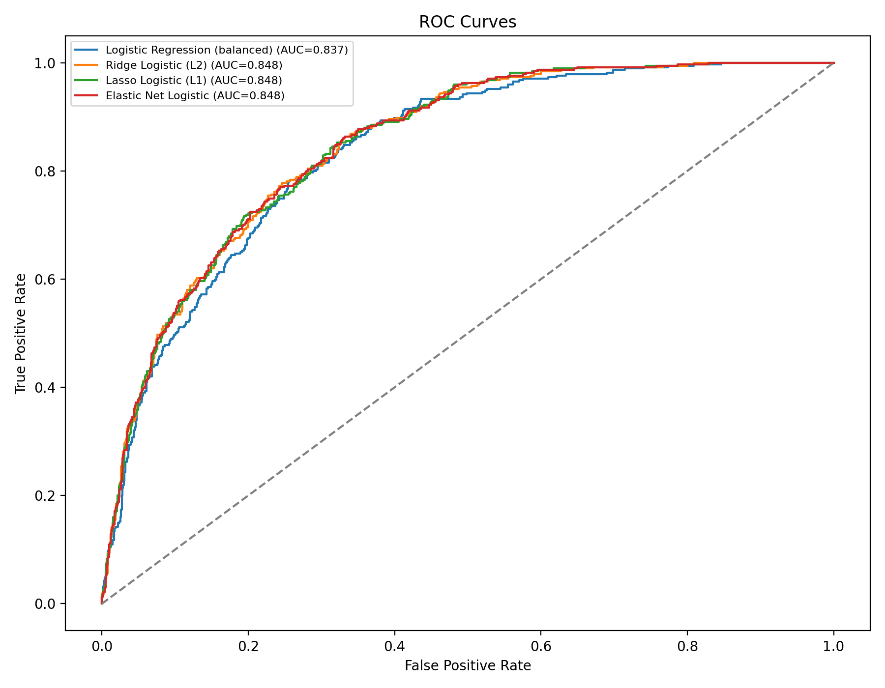
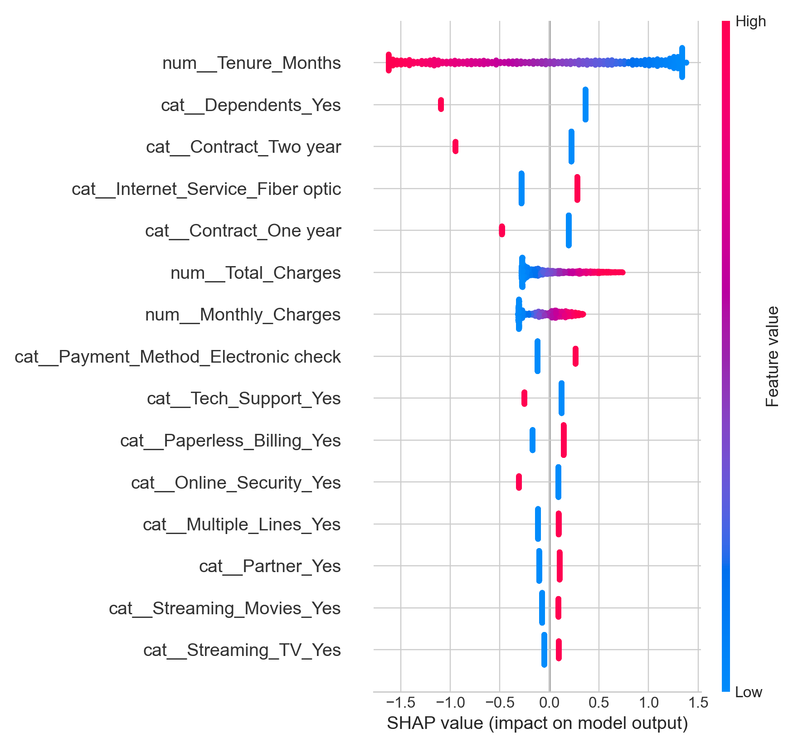
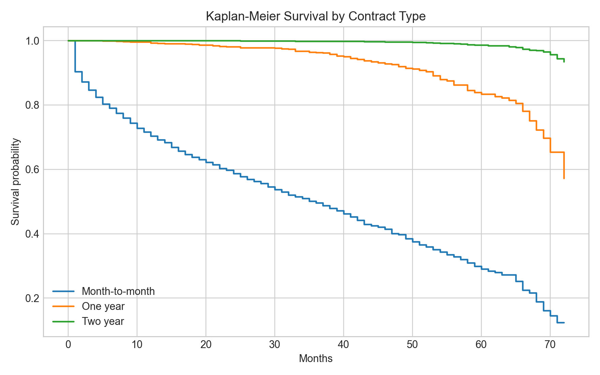

# Telecom Customer Churn Prediction

I built this project to predict which telecom customers are likely to cancel their service, and then to take those predictions a step past a single accuracy score and turn them into something a retention team could actually act on. It started as a baseline logistic regression study on the public Telco Customer Churn dataset, and I added four extension modules on top of it to practice explainability, uplift modeling, survival analysis, and basic business ROI math. My main goal was to understand how a churn model gets from a raw metric to a decision, and to stay honest about which parts of the work are real analysis on the data and which parts are only a demonstration of a technique.

This was a group project for CSC 398 Independent Study, built together with Moeez Islam Malik and Muhammad Abdullah Saleem.

## Dataset

The data is the Telco Customer Churn dataset (`Telco_customer_churn-2.xlsx`), which has about 7,043 customers and 33 columns covering demographics, the services each customer subscribes to, billing and contract details, and whether the customer churned. The prediction target is the binary `Churn_Value` field. I use a stratified 80/20 train and test split with 5-fold cross-validation, and I drop identifier and post-outcome columns such as `Churn_Reason` and `Churn_Score` so they cannot leak into the features.

## Baseline model

`churn_baseline_pipeline.py` is the core of the project. It cleans the data, builds a preprocessing pipeline (median imputation and scaling for numeric features, most-frequent imputation and one-hot encoding for categorical features), and trains four logistic regression variants: a class-balanced baseline, Ridge (L2), Lasso (L1), and Elastic Net. It tunes them with grid search on ROC AUC, compares them, runs a threshold analysis, extracts coefficients and odds ratios, and checks probability calibration.

Real results on the held-out test set, taken from `outputs/model_comparison_results.csv` and `outputs/calibration_results.csv`:

- Elastic Net logistic: test ROC AUC 0.8484, PR AUC 0.6452, recall 0.781 at the 0.5 threshold
- Ridge (L2): test ROC AUC 0.8477
- Lasso (L1): test ROC AUC 0.8476
- Class-balanced baseline: test ROC AUC 0.8366
- Calibrating the Elastic Net model with isotonic regression lowered its Brier score from 0.1641 to 0.1361, so the predicted probabilities became more reliable.



*ROC curves for the four logistic models on the test set, all sitting well above the random-guess diagonal.*

## What's real

These three modules run genuine analyses on the actual dataset. The numbers below come from the restored `outputs/` folder.

### Module 1: SHAP explainability (`module1_shap_explainability.py`)

This fits the calibrated Elastic Net model and runs a SHAP `LinearExplainer` on the real test data to explain both the model as a whole and individual customers. It writes a beeswarm summary, three waterfall plots for the highest-risk customers, three dependence plots, and a table of the most important features. The strongest drivers by mean absolute SHAP value were tenure (0.916), having dependents (0.533), a two-year contract (0.395), fiber optic internet (0.282), and a one-year contract (0.256). These match the coefficient signs from the logistic model, which was a useful sanity check.



*SHAP beeswarm summary of the top 15 features, showing how each feature pushes an individual customer's prediction toward or away from churn.*

### Module 3: Survival analysis (`module3_survival_analysis.py`)

This reframes churn as a time-to-event problem, using customer tenure in months as the duration and churn as the event. It fits Kaplan-Meier curves overall and split by contract type, a Cox proportional hazards model for hazard ratios, and a Weibull AFT model for predicted survival time. On the test set the Cox model reached a concordance index of 0.9028. One honest caveat: that value is probably optimistic, because tenure is the duration and some predictors such as total charges are correlated with tenure, so there is overlap between the duration and the features. For the five highest-risk customers, predicted median survival ranged from about 3.24 to 11.05 months.



*Kaplan-Meier survival curves by contract type, showing month-to-month customers churning earliest and longer contracts retaining customers longer.*

### Module 4: Revenue at risk and ROI simulation (`module4_revenue_roi.py`)

This connects the churn probabilities to money. For each customer it computes annualized revenue at risk as calibrated churn probability times monthly charges times 12, then ranks customers by that exposure. It also sweeps decision thresholds to estimate the net return of a retention campaign. Total revenue at risk for customers with a churn probability of 0.4 or higher was $242,525.92. Using the built-in assumptions of a $50 offer cost, a 30 percent save rate among caught churners, and $65 of monthly revenue retained for 12 months, every tested threshold produced a positive net ROI, ranging from about $41,932 at a 0.2 threshold down to about $25,336 at a 0.6 threshold. Those dollar assumptions are inputs I chose, not values measured from the data, so this is a scenario tool rather than a promised return.

## Module 2: Uplift modeling, using simulated treatment data

I want to be direct about this module. `module2_uplift_modeling.py` demonstrates the uplift modeling method with a T-learner that compares a treated model against a control model, but it does not use real treatment data, because the Telco dataset has no treatment or control field. There is no record of which customers were actually offered a retention deal. To make the method runnable, the module generates a random treatment assignment and then simulates the churn outcome from the true labels with a hand-chosen effect size of about 25 percent.

Because that effect is written into the code, the resulting uplift scores and the segment counts (474 Persuadables, 231 Sure Things, 473 Lost Causes, and 231 Do Not Disturb) reflect the simulation setup rather than a real causal effect on these customers. The Qini-style curve is drawn from the model's own predicted uplift, so it should not be read as a validation of real incremental impact.

This module is here as a methodology demonstration and a template. To turn it into a real result, you would need data from an actual randomized retention experiment (an A/B test) and then retrain the same T-learner on those observed treatment and control outcomes.

## Setup

Requires Python 3.10 or newer.

```bash
python -m venv .venv
source .venv/bin/activate

pip install pandas numpy scikit-learn matplotlib scipy openpyxl statsmodels
pip install -r requirements_novelty.txt
```

`requirements_novelty.txt` covers the extension libraries (shap, lifelines, seaborn, causalml). The `openpyxl` package is needed to read the Excel dataset, and `statsmodels` is used for the optional Probit comparison in the baseline pipeline.

## Running the code

Run each script from the project root. Each one loads the dataset, fits its models, and writes results into the `outputs/` folder.

```bash
python churn_baseline_pipeline.py        # baseline models, metrics, calibration
python module1_shap_explainability.py    # SHAP plots and feature table
python module2_uplift_modeling.py        # uplift demo on simulated treatment
python module3_survival_analysis.py      # Kaplan-Meier, Cox, Weibull models
python module4_revenue_roi.py            # revenue at risk and ROI sweep
```

Run `churn_baseline_pipeline.py` first, since it produces the baseline comparison and calibration files that the writeup refers to. The four modules each rebuild the model they need from `novelty_common.py`, so after the dataset is in place they can be run in any order.

## Repository layout

- `churn_baseline_pipeline.py`: baseline logistic models, tuning, evaluation, calibration
- `novelty_common.py`: shared data loading, cleaning, and the calibrated Elastic Net used by the modules
- `module1_shap_explainability.py`: SHAP explainability
- `module2_uplift_modeling.py`: uplift modeling on simulated treatment
- `module3_survival_analysis.py`: survival analysis
- `module4_revenue_roi.py`: revenue at risk and ROI simulation
- `outputs/`: generated tables, figures, and report files
- `Telco_customer_churn-2.xlsx`: the dataset
- `requirements_novelty.txt`: extension dependencies

## Limitations

The dataset is a public benchmark and may not match any specific provider's current customers. The models are mostly linear, so they can miss nonlinear interactions. I did not run temporal or external validation on a separate cohort. The uplift module is simulated, as described above. The ROI figures depend on assumptions I chose rather than measured costs. Coefficients and hazard ratios show association, not proven causation.
